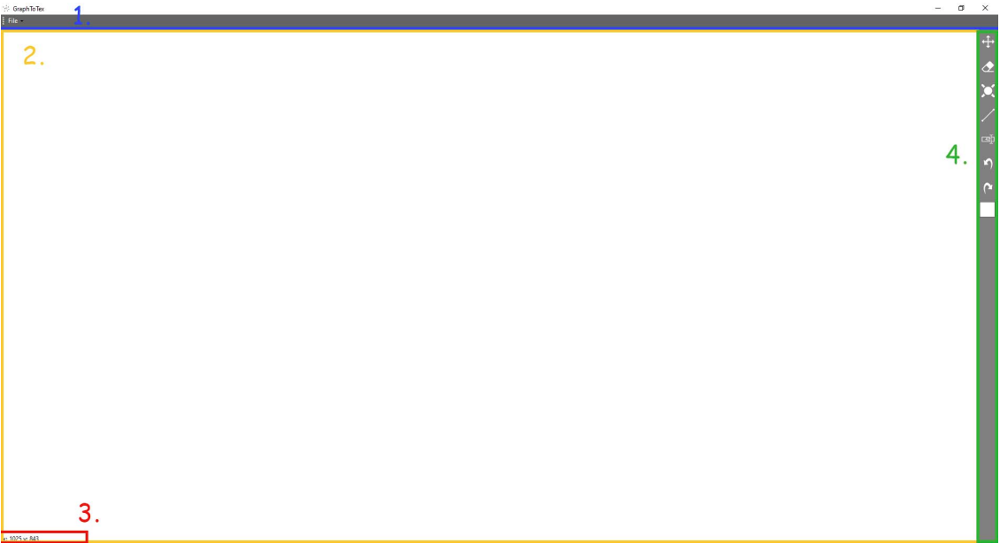
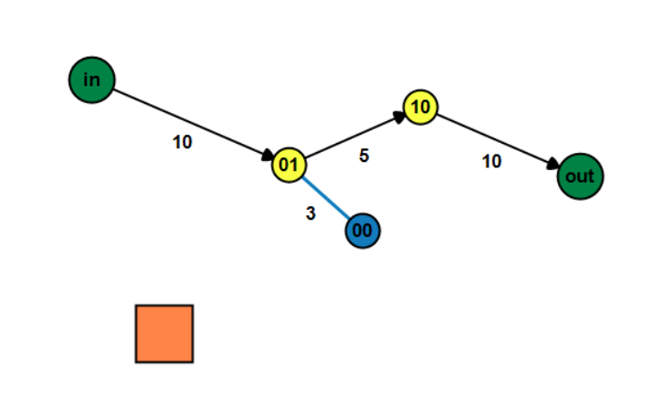

# Simple Graph Editor

Simple desktop application for creating and editing graphs (nodes and edges).  
The application is implemented in **C# using Windows Forms**.

The editor allows users to visually create directed and undirected graphs and export
them in several formats.

---

## Screenshot

### Editor interface

Main components of the editor:

1. **Toolstrip** – main application menu  
2. **Canvas** – workspace where the graph is created  
3. **Info panel** – displays information and coordinates  
4. **Tools panel** – graph editing tools  

### Example graph

---

## Features

- Visual creation of graph nodes
- Edge insertion (directed / undirected)
- Node and edge value editing
- Dragging and deleting graph elements
- Undo / redo operations
- Customizable node and edge appearance
- Graph export options:
  - edge list
  - adjacency list
  - canvas screenshot (.jpg)

---

## Architecture

The application follows the **Model-View-Presenter (MVP)** design pattern.

Main parts of the system:

- **Models** – graph representation and data structures
- **Views** – Windows Forms UI components
- **Presenters** – application logic and state machines

Graph editing modes are handled by a **state machine** (`GraphEditorMachine`).

---

## Documentation

Full technical documentation (Czech):

📄 [Project documentation (PDF)](./dokumentace.pdf)

---

## License

All rights reserved.

This project is publicly visible for educational purposes only.  
Use of this code requires explicit permission from the author.

---

## Author

Ondřej Kříž
